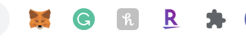

# Wave Portal 

Welcome! Due to my wave portal application codebase having various wallet addresses I am not able to post the code as that is sensitive information. 
However, this readme will explain how to interact with the application and how it works. 
First lets setup your metamask wallet to interact. 

Setup: 
1.) Go to the Metamask website
 
2.) Click “Get Chrome Extension” to install Metamask or go here to add it https://chrome.google.com/webstore/detail/metamask/nkbihfbeogaeaoehlefnkodbefgpgknn?hl=en
 
3.) Click “Add to Chrome” in the upper right
 
4.) Click “Add Extension” to complete the installation
 
5.) You will know Metamask has been installed when their is a fox logo on the top right corner of your browser

Using Metamask: 
Step 1: Click on the Metamask/Fox logo in the upper right hand corner of your browser.
 
Step 2: Read & Agree to the terms and conditions. 
 
Step 3: Setup your password and proceed by clicking "Create" to have a wallet. 
 
Step 4: You will then see 12 words which is considered your "seed phrase" make sure to securely save this phrase with whatever method you wish. 
 
Step 5: 
