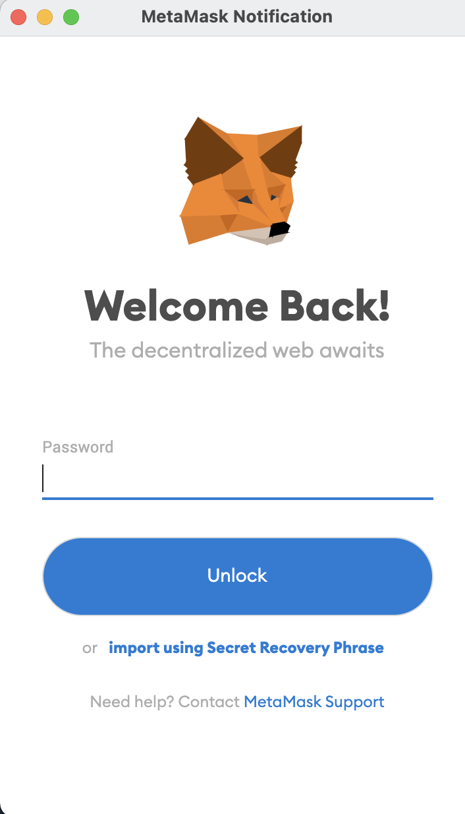

# Wave Portal 

Welcome! Due to my wave portal application codebase having various wallet addresses I am not able to post the code as that is sensitive information. 
However, this readme will explain how to interact with the application and how it works. 
First lets setup your metamask wallet to interact. 

Setup: 

